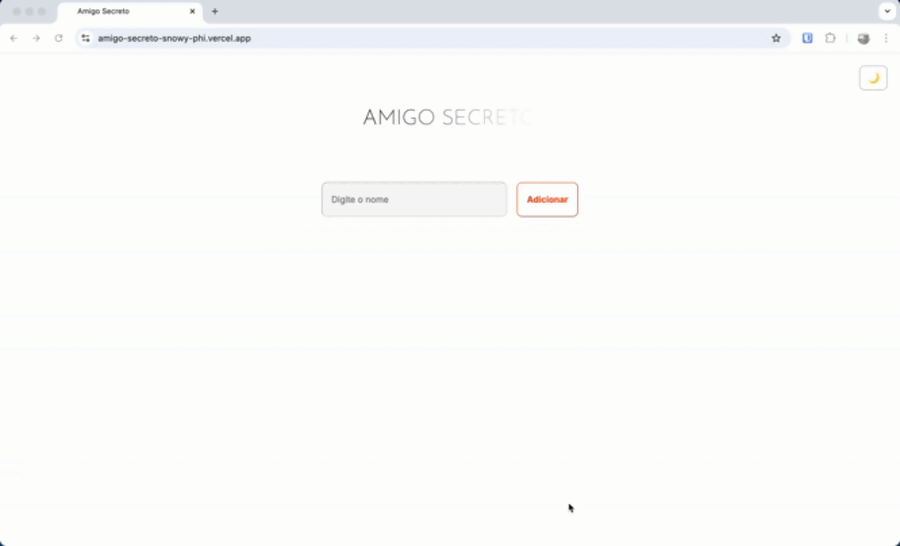

# Secret Friend (Amigo Secreto)

🔗 [Live Demo on Vercel](https://amigo-secreto.vercel.app)

## Project Overview

This is a simple web application to manage a **Secret Friend (Amigo Secreto)** game. Users can add friends' names, view the list dynamically, remove friends if needed, and perform a random draw to select a secret friend from the list.

---

## Features

- **Add Friends:** Enter names into the input field and add them to an array.
- **Validation:** Prevents adding empty or duplicate names.
- **Display Friend List:** Shows all added friends as a styled list below the input.
- **Remove Friend:** Each friend has a remove button to delete them from the list.
- **Random Draw:** Clicking "Sortear Amigo" randomly selects a friend from the list and displays the result.

---

## Project Demo
<div align="center">
  
</div>

---

## How to Run Locally

1. Clone the repository:
```
git clone https://github.com/denisemignoli/amigo-secreto.git
```
2. Open the `index.html` file in your browser by:
- Double-clicking the file, or
- Using a live server extension such as **Live Server** in VSCode.


